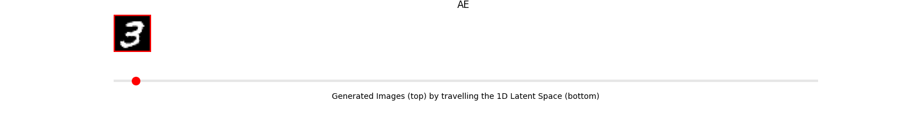
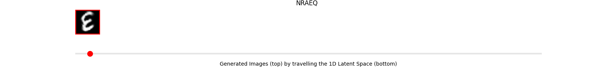
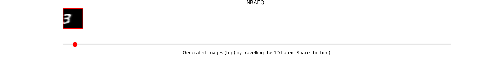

# Neighborhood Reconstructing Autoencoders
The official repository for \<Neighborhood Reconstructing Autoencoders\> (Lee, Kwon, and Park, NeurIPS 2021).

> This paper proposes Neighborhood Reconstructing Autoencoders (NRAE), which is a **graph**-based autoencoder that explicitly accounts for the **local connectivity and geometry** of the data, and consequently learns a **more accurate data manifold and representation**.

- *Paper: [TBU]()*  
- *15-mins video: [TBU]()*  
- *[Slides] (./doc/NRAE_talk.pdf)*  
- *Poster: [TBU]()*  
- *[OpenReview] (https://openreview.net/forum?id=_kaH2bAI3O&referrer=%5BAuthor%20Console%5D(%2Fgroup%3Fid%3DNeurIPS.cc%2F2021%2FConference%2FAuthors%23your-submissions))*  

## Preview (synthetic data)
<center>
<div class="imgCollage">
<span style="width: 31.8%"></span>
<span style="width: 31.8%"> </span>
<span style="width: 31.8%"> </span>
</div>
  <I>Figure 1: De-noising property of the NRAE (Left: Vanilla AE, Middle: NRAE-L, Right: NRAE-Q). </I>
</center>

<center>
<div class="imgCollage">
<span style="width: 31.8%"></span>
<span style="width: 31.8%"> </span>
<span style="width: 31.8%"> </span>
</div>
  <I>Figure 2: Correct local connectivity learned by the NRAE (Left: Vanilla AE, Middle: NRAE-L, Right: NRAE-Q).</I>
</center>

## Preview (rotated/shifted MNIST)
<center>
<div class="imgCollage">
<span style="width: 100%"></span>
<span style="width: 100%"> </span>
<span style="width: 100%"> </span>
</div>
  <I>Figure 3: Generated sequences of rotated images by travelling the 1d latent spaces (Top: Vanilla AE, Middle: NRAE-L, Bottom: NRAE-Q). </I>
</center>

<center>
<div class="imgCollage">
<span style="width: 100%"></span>
<span style="width: 100%"> </span>
<span style="width: 100%"> </span>
</div>
  <I>Figure 3: Generated sequences of shifted images by travelling the 1d latent spaces (Top: Vanilla AE, Middle: NRAE-L, Bottom: NRAE-Q). </I>
</center>

## Environment

The project is developed under a standard PyTorch environment.
- python 3.8.8
- numpy 
- matplotlib 
- imageio 
- argparse 
- yaml 
- omegaconf 
- torch 1.8.0
- CUDA 11.1

## Running 
```
python train_{X}.py --config configs/{A}_{B}_{C}.yml --device 0
```
- `X` is either `synthetic` or `MNIST`
- `A` is either `AE`, `NRAEL`, or `NRAEQ`
- `B` is either `toy` or `mnist`
- If `B` is `toy`, then `C` is either `denoising` or `geometry_preserving`. Elseif `B` is `mnist`, then `C` is either `rotated` or `shifted`.

### Playing with the code
- The most important parameters requiring tuning include: i) the number of nearest neighbors for graph construction `num_nn` and ii) kernel parameter `lambda` (you can find these parameters in `configs/NRAEL_toy_denoising.yml` for example). 
- We empirically observe that setting as `include_center=True` (when defining data loader) has performance advantange. 
- You can add a new type of 2d synthetic dataset in `loader.synthetic_dataset.SyntheticData.get_data` (currently, we have `sincurve` and `swiss_roll`).

## Citation
To be updated.
